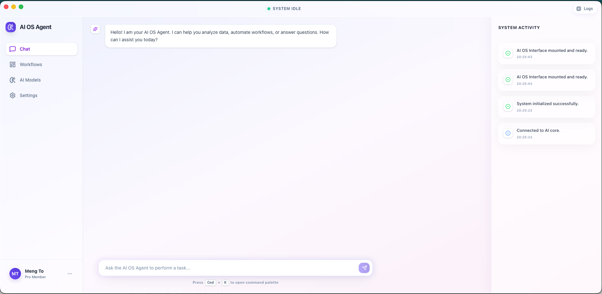
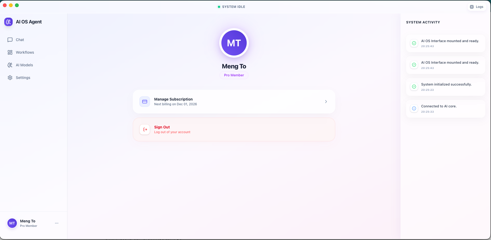
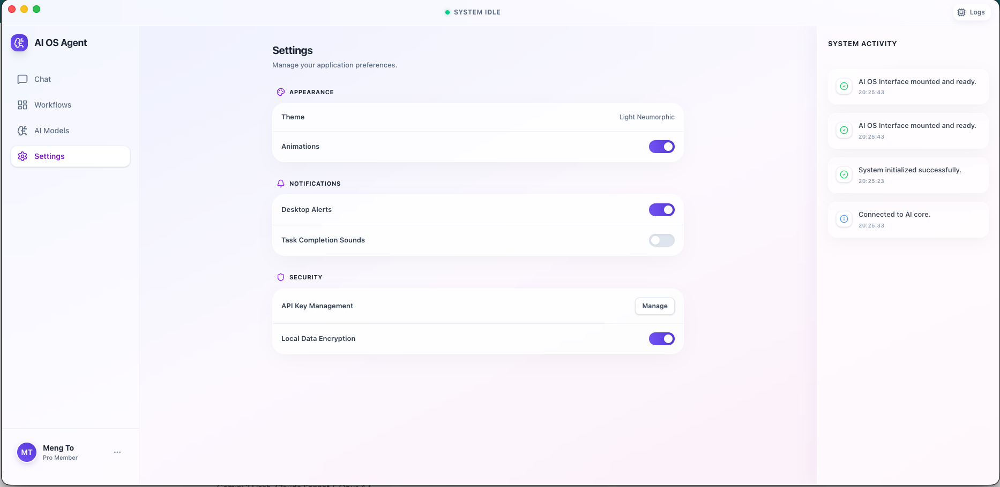
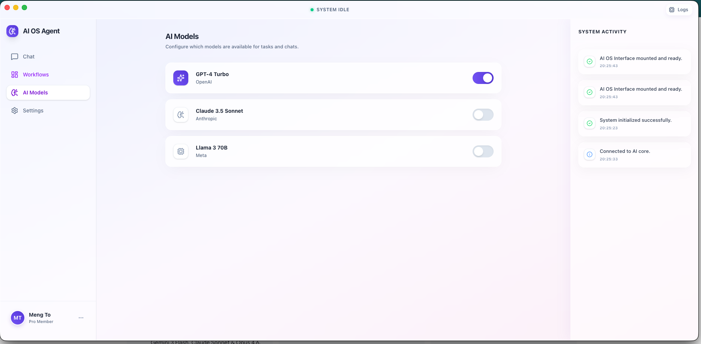

# AI OS Agent - Premium Desktop Application

A state-of-the-art, premium AI operating system agent interface built with Electron, React, and Tailwind CSS. Featuring a stunning glassmorphic design, smooth animations, and a multi-panel dashboard for managing chats, workflows, and AI models.

## Screenshots

<p align="center">
  
  
</p>

<p align="center">
  
  
</p>

## ✨ Features

- **Glassmorphic UI**: Premium translucent interface with real-time backdrop-blur effects.
- **Dynamic Dashboard**: Seamless switching between Chat, Workflows, AI Models, and Settings.
- **Real-time Activity Log**: A live "System Activity" panel that tracks agent actions.
- **Advanced Animations**: Powered by Framer Motion for a buttery-smooth desktop experience.
- **Customizable AI Models**: Interactive UI for toggling and configuring different LLMs.
- **Command Palette**: (Cmd + K) quickly search and execute actions.

## 🛠️ Technology Stack

- **Framework**: [React 19](https://react.dev/)
- **Desktop**: [Electron](https://www.electronjs.org/)
- **Styling**: [Tailwind CSS 4](https://tailwindcss.com/)
- **Animations**: [Framer Motion](https://www.framer.com/motion/)
- **State Management**: [Zustand](https://zustand-demo.pmnd.rs/)
- **Icons**: [Lucide React](https://lucide.dev/)
- **Build Tool**: [Vite 6](https://vite.dev/)

## 🚀 Getting Started

### Prerequisites

- **Node.js**: `v18.0.0` or higher (Recommended: `v20+`)
- **NPM**: `v9+` or **Yarn** / **PNPM**

### Installation

1. Clone the repository:
   ```bash
   git clone <your-repo-url>
   cd ai-agent
   ```

2. Install dependencies:
   ```bash
   npm install
   ```

### Development

To start the app in development mode with hot-reloading:

```bash
npm run dev
```

### Building for Production

To pack the app for your current operating system:

```bash
npm run build
```

## 📂 Project Structure

```bash
├── electron/          # Main process & Preload scripts
├── src/
│   ├── components/    # UI components (Chat, Workflows, etc.)
│   ├── layouts/       # Dashboard shell and layout logic
│   ├── store/         # Zustand global state (App, Chat, Activity)
│   ├── App.tsx        # Main application router
│   └── index.css      # Design system & glass effects
└── public/            # Assets & Icons
```

## 🤝 Contributing

Contributions are welcome! Please feel free to submit a Pull Request.

## 📄 License

This project is licensed under the MIT License.
